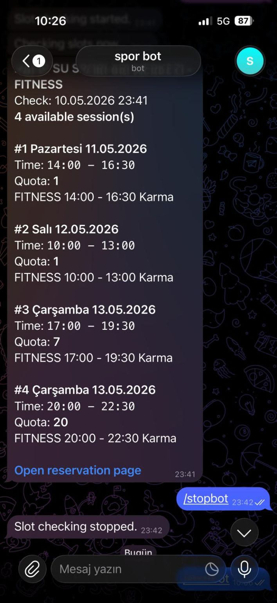

# 🤖 SporBot

An automated Python bot that monitors available **Spor İstanbul** reservation slots using **Playwright** and instantly sends notifications through **Telegram** whenever a matching session becomes available.

<p align="left">
  
  
  
  
  
</p>

---

# 📖 Overview

SporBot automatically checks **Spor İstanbul** reservation slots and notifies users via Telegram when an available session is found.

Instead of manually refreshing the reservation page for hours, the bot continuously monitors availability and alerts the user instantly.

---

# 📸 Screenshot

<p align="center">

</p>

---

# ✨ Features

- 🤖 Automated reservation monitoring
- 🔔 Instant Telegram notifications
- ⏱ Configurable checking interval
- 🏋 Runtime branch selection
- ⌛ Run for a specified duration
- 🛑 Start / Stop via Telegram commands
- 🐳 Docker support
- ⚙ Runtime configuration without restarting

---

# 🛠 Tech Stack

| Technology | Purpose |
|------------|---------|
| Python | Core application |
| Playwright | Browser automation |
| Telegram Bot API | Notifications & remote control |
| Docker | Containerized deployment |
| Python-dotenv | Environment configuration |

---

# 📂 Project Structure

```
sporbot/
│
├── app.py
├── checker.py
├── telegram_service.py
├── runtime_config.py
├── bot.py
├── Dockerfile
├── docker-compose.yml
└── .env.example
```

---

# 🚀 Getting Started

## Clone the repository

```bash
git clone https://github.com/USERNAME/sporbot.git
cd sporbot
```

---

## Install dependencies

```bash
pip install -r requirements.txt
playwright install chromium
```

---

## Configure environment variables

Create a `.env` file.

```bash
cp .env.example .env
```

Example:

```env
SPOR_TC=
SPOR_SIFRE=
TELEGRAM_BOT_TOKEN=
TELEGRAM_CHAT_ID=
```

---

## Run

```bash
python app.py
```

Or using Docker

```bash
docker compose up --build
```

---

# 💬 Telegram Commands

| Command | Description |
|----------|-------------|
| `/start` | Show help |
| `/startbot` | Start monitoring |
| `/stopbot` | Stop monitoring |
| `/status` | Bot status |
| `/runfor 180` | Run for a specific duration |
| `/setinterval 10 15` | Change checking interval |
| `/setbranch FITNESS` | Change branch |
| `/stopafterfound on` | Stop after finding a session |

---

# 🔒 Security

Sensitive information is **never committed** to the repository.

The following files should remain local:

- `.env`
- `runtime_config.json`
- `bot.log`
- `logs/`
- `data/`

---

# 📌 Future Improvements

- Multi-user support
- Multiple branch monitoring
- Web dashboard
- Statistics & analytics
- Desktop GUI
- Cloud deployment

---

# 📄 License

This project is licensed under the **MIT License**.